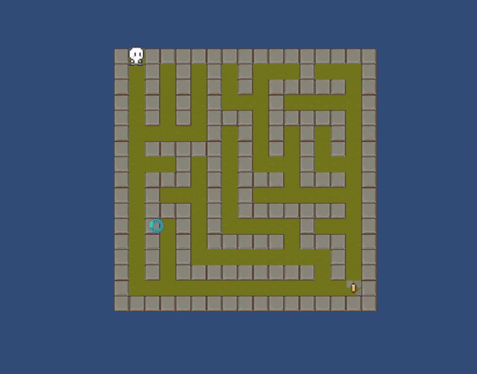
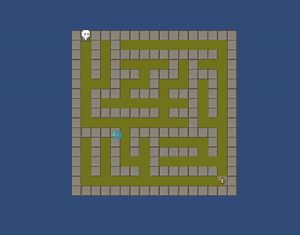

### 진행 상황 기록

- 플레이어 초기위치를 TileType.Start인 오브젝트의 position으로 지정
- 플레이어 이동시 벽인지 체크해서 이동 제한
    - 플레이어가 미로 배열(tile)에서 어디 idx에 위치한지 기록
- InputManager 생성 --> 인풋값은 이제 여기서 관리
- TileType Define으로 이동 -->enum은이제 모두 여기서 관리..~~하는게 나으려나..?~~
- 텍스처 및 애니메이션 추가
- 몬스터 생성
- 몬스터 경로 생성
- `MonsterController`, `PlayerController` 가 `MoveController` 상속 받게끔. 공통부분은 `MoveController`에 작성

### 목표지점 도착

### 몬스터에 잡혔을 때

